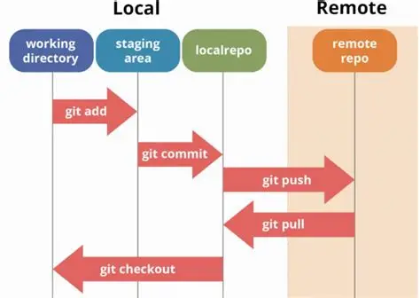

# 🏗️ Module 1: Git Architecture & Workflow

Welcome to **Module 1: Git Architecture & Workflow**, where you will learn **how Git works internally**, its core components, and the typical workflow used in software development.

---

## 🧠 **Why Understand Git Architecture?**

Before using any tool effectively, it is crucial to know **how it works under the hood**. Git's architecture:

- Explains why Git is fast and reliable  
- Helps you understand where your changes go at each stage  
- Clarifies commands like `add`, `commit`, `push`, and `pull` deeply

---

## 🏢 **Core Components of Git**

Git has four main areas:

---

### **1. Working Directory**

📁 **What is it?**

- Your **local project folder** where you create, edit, and delete files.  
- Changes here are **not tracked** by Git until staged.

🔍 **Example:**

When you edit `index.html`, Git knows the file changed (using SHA hash comparison) but does **not** include it in the next commit until you `add` it.

---

### **2. Staging Area (Index)**

📝 **What is it?**

- A **preparation area** where you tell Git **which changes to include in your next commit**.  
- Acts like a shopping cart before checkout.

🔧 **Commands:**

- Stage a file:
  ```bash
  git add index.html
```

Stage all changes:

  ```bash
  git add .
```

🔍 **Example:**

If you edited `index.html` and `main.css` but only want to commit changes to `index.html`, stage only that file.

---

### **3. Local Repository**

💾 **What is it?**

* Your **complete database of commits and branches stored locally**.
* When you commit changes, they are saved here with a **unique SHA-1 hash**.

🔍 **Example:**

```bash
git commit -m "Add navbar styling"
```

This creates a snapshot of the staged changes in your local repository. It does **not** affect the remote server until you push.

---

### **4. Remote Repository**

🌐 **What is it?**

* A **copy of your repository hosted on platforms** like GitHub, GitLab, or Bitbucket.
* Enables sharing code, collaborating, and backing up your local repository.

🔧 **Commands:**

* Push changes to remote:

  ```bash
  git push origin main
  ```
* Pull changes from remote:

  ```bash
  git pull origin main
  ```

---

## 🔄 **Visualising Git Workflow (Text Diagram)**



- ✔️ **Working Directory:** Where you edit files
- ✔️ **Staging Area:** Where you prepare files for commit
- ✔️ **Local Repository:** Where commits are stored locally
- ✔️ **Remote Repository:** Where commits are pushed for sharing

---

## 🗂️ **Git Objects**

Git’s database stores four types of objects:

1. **Blob (Binary Large Object):** Stores file data
2. **Tree:** Stores directory structure and file metadata
3. **Commit:** Stores a snapshot pointer with metadata (author, date, message)
4. **Tag:** Labels specific commits for releases

🔑 **SHA-1 Hash**

Every object is identified by a unique **SHA-1 hash**, ensuring **data integrity** and **immutability**.

---

## ⚡ **Why is Git Fast?**

* Local operations (commits, diffs) do **not need a network connection**.
* Uses **hashing and compression** to store data efficiently.
* Only changes are saved (delta storage), making operations lightweight.

---

## 🧩 **Understanding HEAD**

🧭 **What is HEAD?**

* A pointer that **refers to the current branch reference**, usually the **latest commit you are on**.

🔍 **Example:**

When you checkout a branch, HEAD points to the latest commit on that branch. If you checkout a specific commit (detached HEAD), HEAD points directly to that commit instead of a branch name.

---

## 🔀 **Branches as Pointers**

In Git:

* A **branch** is simply a **movable pointer** to a commit.
* Creating a branch does **not duplicate files**; it creates a new pointer.

This is why branching and switching are **fast operations** in Git compared to older VCS.

---

## ❗ **Common Misunderstandings**

### **1. git add commits the file**

❌ **Misunderstanding:**
`git add` saves the file permanently in Git history.

✅ **Reality:**
`git add` only stages the file. You need to `git commit` to save it in the local repository.

---

### **2. git commit sends changes to GitHub**

❌ **Misunderstanding:**
`git commit` uploads changes to the remote repository (e.g., GitHub).

✅ **Reality:**
`git commit` only saves changes in your **local repository**. You must `git push` to send them to the remote.

---

### **3. Branches are separate copies of files**

❌ **Misunderstanding:**
Each branch duplicates the entire codebase, using a lot of space.

✅ **Reality:**
Branches are **just lightweight pointers** to commits. Git stores differences efficiently using snapshots and delta compression.

---

### **4. Remote repositories are always updated**

❌ **Misunderstanding:**
When you commit locally, your GitHub repository is automatically updated.

✅ **Reality:**
Changes remain local until you explicitly `git push` to update the remote repository.

---

### **5. HEAD is the first commit**

❌ **Misunderstanding:**
HEAD points to the first commit.

✅ **Reality:**
HEAD points to the **current commit or branch reference** you are working on.

---

## 💡 **Summary**

In this module, you learned:

* The **four main areas** of Git (Working Directory, Staging Area, Local Repo, Remote Repo)
* Git’s underlying **data structure and objects**
* How **HEAD** and **branches as pointers** work
* Why Git is fast and efficient
* **Common misunderstandings** to avoid

👉 Proceed to [Module 2: Git Basics](../2_git_basics/README.md) to start executing **fundamental commands** hands-on.

---

**Happy Learning!**

> *“Knowing how Git stores and tracks your data transforms it from a tool you use to a tool you master.”*

