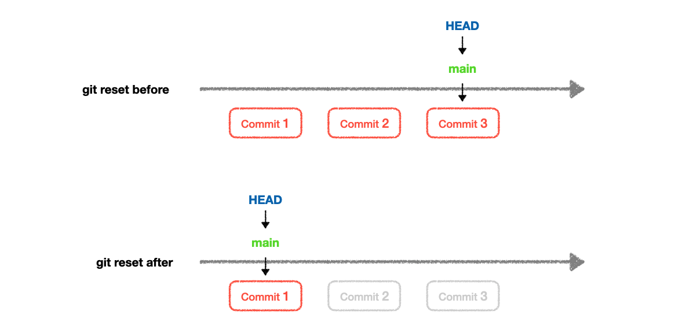

# 🔄 Module 7: Undoing Changes

Welcome to **Module 7: Undoing Changes**, where you will learn to safely undo mistakes, unstage files, reset commits, and revert history while understanding their implications.

---

## 📝 **1. Why Undoing is Critical**

Version control’s power lies in the ability to:

✔️ **Undo mistakes without fear**  
✔️ Maintain project stability  
✔️ Experiment confidently knowing you can revert

---

## ❌ **2. git checkout**

🔧 **Purpose:**  
Discard changes in working directory or revert files to a previous commit.

### **Syntax:**

```bash
git checkout [options] <commit> -- <file>
````

### **Examples:**

* Discard changes in a file:

  ```bash
  git checkout -- filename.txt
  ```

* Restore file to specific commit:

  ```bash
  git checkout abc123 -- filename.txt
  ```

✅ **Note:** `git checkout` for switching branches is replaced with `git switch` in newer Git versions.

---

## 🗂 **3. git restore**

🔧 **Purpose:**
Modern replacement for discarding changes or restoring files.

### **Syntax:**

```bash
git restore [options] <file>
```

### **Examples:**

* Discard local changes:

  ```bash
  git restore filename.txt
  ```

* Discard staged changes:

  ```bash
  git restore --staged filename.txt
  ```

* Restore file from a commit:

  ```bash
  git restore --source=abc123 filename.txt
  ```

---

## 🔙 **4. git reset**

🔧 **Purpose:**
Move HEAD and optionally modify staging area or working directory.



--- 

### **Syntax:**

```bash
git reset [options] [<commit>]
```

### **Types of Reset:**

| Type            | Command                    | Effect                                                   |
| --------------- | -------------------------- | -------------------------------------------------------- |
| Soft            | `git reset --soft HEAD~1`  | Moves HEAD, keeps changes staged                         |
| Mixed (default) | `git reset --mixed HEAD~1` | Moves HEAD, unstages changes, keeps in working directory |
| Hard            | `git reset --hard HEAD~1`  | Moves HEAD, discards all changes                         |

---

### **Examples:**

* Unstage a file:

  ```bash
  git reset filename.txt
  ```

* Undo last commit but keep changes:

  ```bash
  git reset --soft HEAD~1
  ```

* Undo last commit and unstage changes:

  ```bash
  git reset --mixed HEAD~1
  ```

* Reset to previous commit and delete all changes:

  ```bash
  git reset --hard HEAD~1
  ```

---

### ⚠️ **Edge Cases & Warnings**

| Situation                      | Behavior                                              | Solution                                                 |
| ------------------------------ | ----------------------------------------------------- | -------------------------------------------------------- |
| Using `--hard` deletes changes | Changes lost permanently unless recoverable by reflog | Use `git reflog` to find commit and recover              |
| Resetting public branch        | Overwrites history for collaborators                  | Avoid using reset on shared branches; use revert instead |

---

## ↩️ **5. git revert**

🔧 **Purpose:**
Create a new commit that undoes changes from a previous commit.

### **Syntax:**

```bash
git revert [options] <commit>
```

### **Examples:**

* Revert a single commit:

  ```bash
  git revert abc123
  ```

* Revert multiple commits:

  ```bash
  git revert abc123..def456
  ```

✅ **Note:** Unlike reset, revert is **safe for public branches** as it doesn’t rewrite history.

---

## ❗ **7. Common Misunderstandings**

1. **Reset and revert are the same**


* ❌ **Reset** rewrites history (dangerous for shared branches).
* ✔️ **Revert** creates a new commit undoing changes (safe for public branches).

---

2. **git checkout -- <file> deletes file**

❌ It reverts the file to last committed state, discarding uncommitted changes, but does not delete the file itself.

---

3. **Hard reset permanently deletes everything**

✔️ But you can often recover using `git reflog` if not garbage collected yet.

---

## 💡 **8. Best Practices**

- ✅ Always run `git status` before undoing
- ✅ Avoid `git reset --hard` on public/shared branches
- ✅ Prefer `git revert` for undoing commits in collaborative projects
- ✅ Use `git reflog` as your rescue tool for lost commits or branches

---

## 🎯 **Summary**

In this module, you learned:

* Difference between **checkout, restore, reset, revert, and clean**
* Using reset types (soft, mixed, hard) safely
* Reverting commits without rewriting history
* Cleaning untracked files and folders
* Edge cases, warnings, and recovery strategies

👉 Proceed to [Module 8: Cleaning Up](../8_cleaning_up/README.md) for **keeping your repositories clean**
---

> *“Undoing is not about fear of mistakes, but embracing fearless learning with safety nets in place.”*
